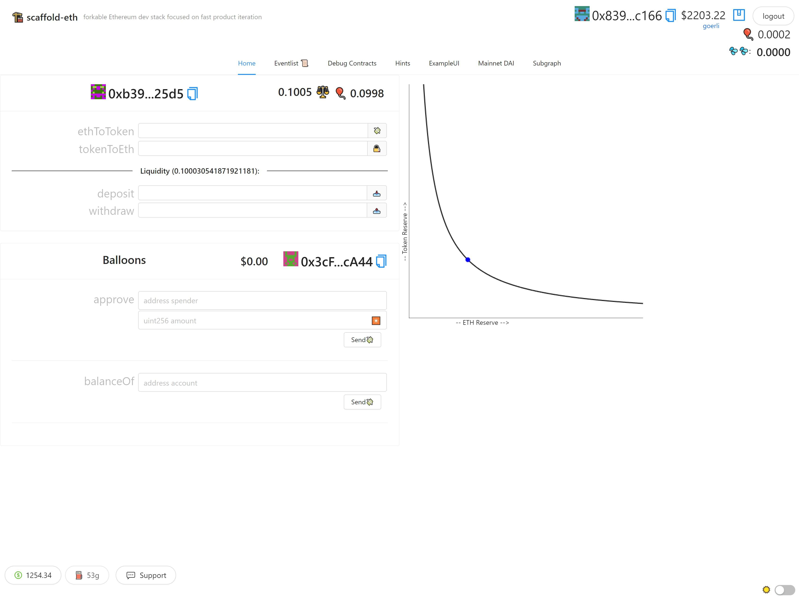

# DEX

This is my solution to [Speed Run Ethereum](https://speedrunethereum.com/)'s Build a DEX Challenge.

This challenge is about building/understanding a simple decentralized exchange, with one token-pair (ERC20 BALLOONS ($BAL) and ETH).

Read about the challenge and code at the repo of the challenge here: https://github.com/scaffold-eth/scaffold-eth-challenges/tree/challenge-4-dex

## Screenshot

## Links

Live Demo: https://dex-ds.surge.sh/

Etherscan Contract: https://goerli.etherscan.io/address/0xb394b51400bd4631189580eb058cbc09236225d5

BuidlGuidl Submission: https://buidlguidl.com/build/9AexQw5n5PIhRfGrqjcd
